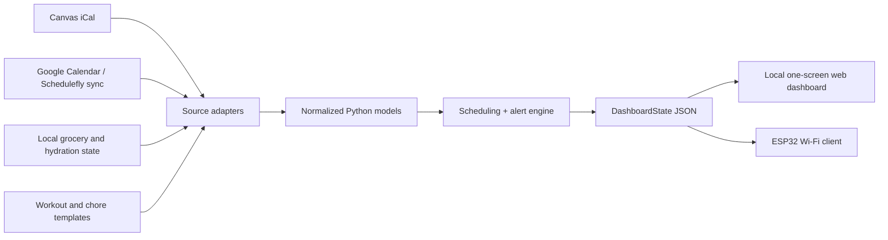

# LifeHub Software Prototype

LifeHub is a mock-data-first calendar and life organization brain for a smart desk. It combines source data in a local Python backend, applies scheduling rules, and emits one clean dashboard JSON object for both a browser and a future ESP32 display.

## Architecture



The source adapters should only normalize external data. Scheduling decisions live in one engine, and display clients only render `DashboardState`. This keeps Canvas, Google, and future hardware changes isolated.

## Folder Structure

```text
lifehub/
  models.py        Shared dataclasses and ESP32-facing contract
  data_loader.py   Mock source adapter
  scheduler.py     Now, next, workout, wind-down, and alert rules
  dashboard.py     DashboardState assembler
  server.py        Local JSON API and static web server
mock_data/         Editable prototype inputs
static/            One-screen browser preview
tests/             Scheduling tests
scripts/           Utility scripts
examples/          Exported example ESP32 payload
```

## Run It

No credentials or third-party packages are required.

```powershell
python -m unittest discover -v
python -m lifehub.server
```

Open `http://127.0.0.1:8000`. The ESP32-style JSON is at `http://127.0.0.1:8000/api/dashboard`.

The browser dashboard is optimized for the HAMTYSAN 10.1-inch 1024x600 touchscreen. It uses a fixed-height layout with a horizontally swipeable card rail and 40px-or-larger touch controls.

To write a snapshot payload:

```powershell
python scripts/export_dashboard.py
```

## Scheduling Rules

- **Now:** active calendar event, then active workout, otherwise an open focus block.
- **Next:** earliest upcoming event or unsubmitted assignment deadline.
- **Workout:** searches from now or 5:00 AM through the usable morning window, skipping calendar conflicts.
- **Workout plan:** stores each day as structured sections with exercises, sets, reps, technical cues, and rest periods.
- **Lift day:** start must be found by 11:15 AM and finish before noon.
- **Non-lift day:** start must be found by 11:30 AM and finish before noon.
- **Backup:** strength circuit for missed lift days; easy run or mobility for missed non-lift days.
- **Wind-down:** tomorrow's first important event minus wake routine, optional morning workout, desired sleep, and wind-down duration.
- **Sleep target:** plans for 8 hours 45 minutes by default, within the preferred 8.5-9 hour range.
- **Wake-up routine:** exposes wake time plus stretch, rollout, shower, breakfast, and hydration check steps.
- **Assignments:** sorted only by due date and labeled overdue, due today, due tomorrow, due this week, or later.

## Alert Levels

| Level | Rule |
|---|---|
| `normal` | More than 24 hours away |
| `soon` | Within 24 hours |
| `urgent` | Within 2 hours |
| `critical` | Within 30 minutes or overdue |

## Integration Roadmap

1. **Canvas iCal:** `scripts/refresh_canvas.py` downloads the private Canvas calendar feed and maps VEVENT items to `Assignment`. Keep the feed URL only in the `CANVAS_ICAL_URL` environment variable.
2. **Google Calendar:** use Google Calendar API read-only access or private iCal feeds, then map events to `CalendarEvent`.
3. **Schedulefly:** the current prototype includes an authenticated weekly schedule snapshot because no calendar-feed control was visible in the employee account. Replace snapshots through the supported Google Calendar synchronization or direct feed if the employer account exposes one.
4. **Grocery web app:** add authenticated local CRUD endpoints and persist groceries in SQLite.
5. **ESP32:** poll `/api/dashboard`, cache the last good payload, render only normalized fields, and send button actions to small local endpoints.
6. **Persistence:** move hydration, grocery, dismissed-alert, and chore completion state from JSON to SQLite.
7. **Operations:** run the backend as a Raspberry Pi service and add sync timestamps, retries, and stale-data alerts.

## Touch Checklists

Chores, groceries, and wake-up steps persist for the current day. Tap individual items or the top `Done` button. Cards show red with nothing complete, yellow when partially complete, and green when complete.

The prototype intentionally does not scrape either login page.
## Live sync, weather, and phone controls

LifeHub now refreshes supported data sources every 15 minutes, fetches credential-free
Golden weather from Open-Meteo, reports stale snapshots, and sends dashboard changes
to every open screen using Server-Sent Events.

The server listens on the local network. On a phone connected to the same Wi-Fi, open:

```text
http://YOUR-RASPBERRY-PI-IP:8000/
```

At phone width the dashboard becomes a vertically scrolling control interface with
quick buttons for hydration, chores, groceries, tomorrow, and manual synchronization.

Settings live in `mock_data/lifehub_config.json`. Paste private iCal URLs into
`canvas_ical_url` and `schedulefly_ical_url` to enable automatic Canvas and work
schedule updates. Leave either blank to continue using its imported snapshot.

Do not store Schedulefly passwords in the project. Use Schedulefly's Google Calendar
integration/private calendar feed when possible; LifeHub will refresh it on startup
and during normal background sync.

To refresh Schedulefly once from the Pi:

```bash
cd "/home/vaughn2014/LifeHub Project"
python3 scripts/refresh_schedulefly.py
```

To run that every morning, add this to `crontab -e` on the Pi:

```text
0 6 * * * cd "/home/vaughn2014/LifeHub Project" && python3 scripts/refresh_schedulefly.py
```

If Schedulefly does not expose a calendar feed, use the browser-session updater:

```bash
cd "/home/vaughn2014/LifeHub Project"
python3 -m pip install playwright
python3 -m playwright install chromium
python3 scripts/refresh_schedulefly_browser.py --headed
```

Log into Schedulefly in the browser window once. After it updates successfully, add
this morning refresh to `crontab -e`:

```text
0 6 * * * cd "/home/vaughn2014/LifeHub Project" && python3 scripts/refresh_schedulefly_browser.py
```

If Schedulefly logs out, run the `--headed` command again and sign in once more.
