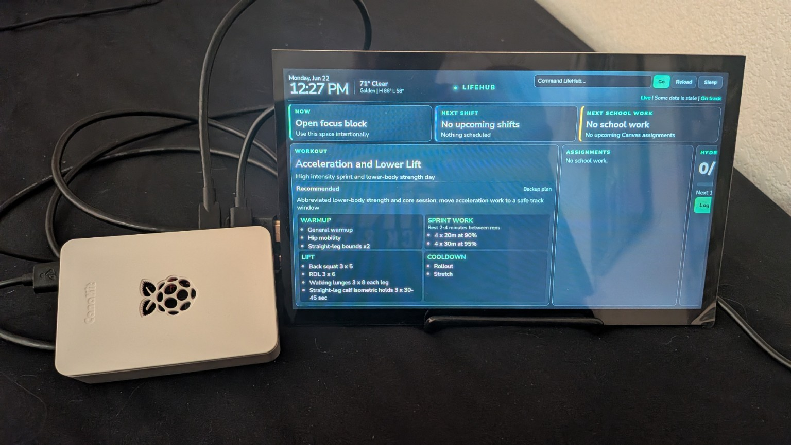
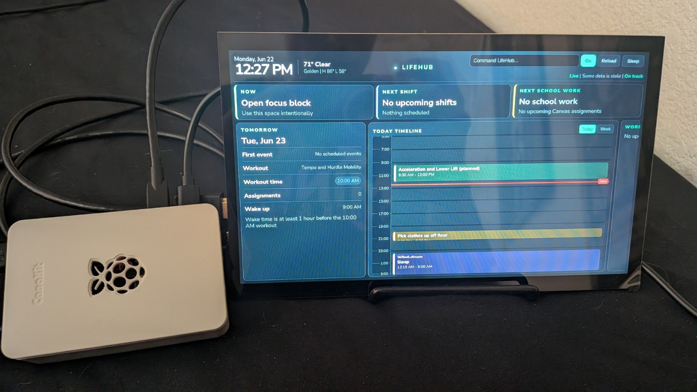
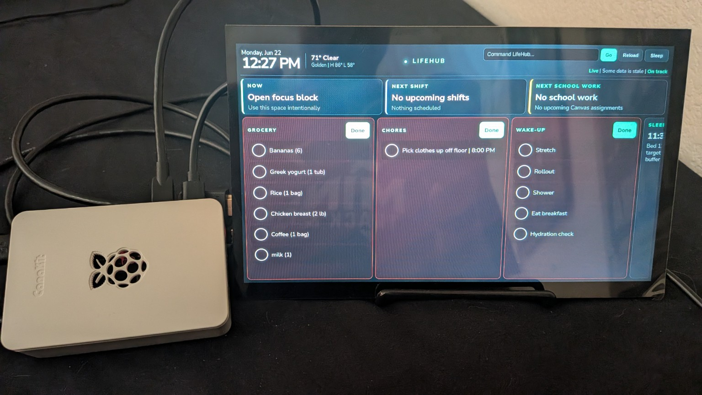
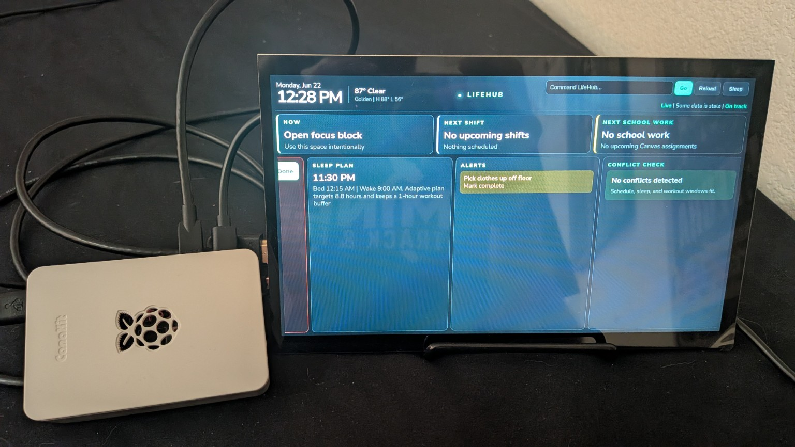
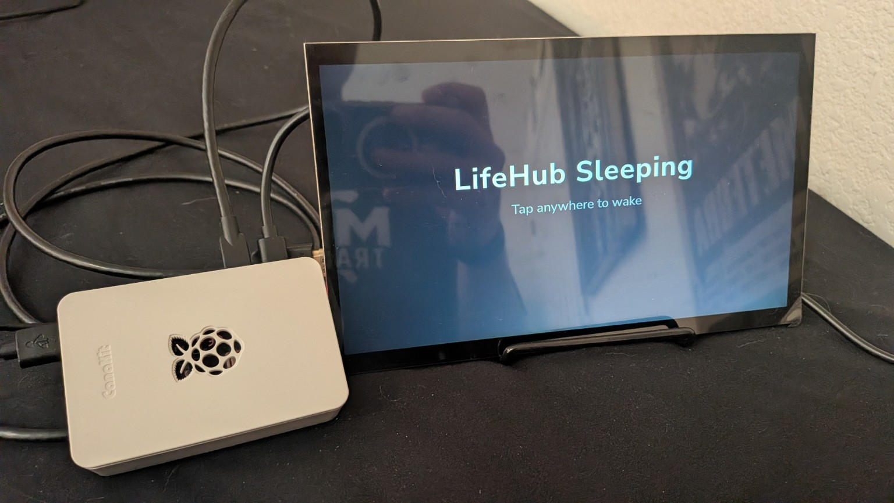
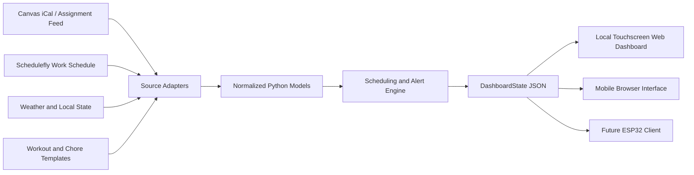

# LifeHub

LifeHub is a Raspberry Pi touchscreen smart desk dashboard built with a Python backend and a responsive local web interface. It combines work schedules, school assignments, workouts, daily routines, weather, chores, groceries, hydration, sleep planning, alerts, and calendar information into one touchscreen-friendly display.

LifeHub runs locally with:

```bash
python -m lifehub.server
```

On the Raspberry Pi, the server starts automatically and launches the dashboard in Chromium fullscreen mode.

## Project Preview

LifeHub runs on a Raspberry Pi 4 connected to a 10.1-inch 1024×600 touchscreen.

### Workout Dashboard

The dashboard displays the current activity, upcoming work and school information, and the complete workout plan for the day.



### Daily Timeline and Tomorrow Preview

The timeline combines workouts, chores, wind-down time, sleep, and other scheduled activities into a visual daily plan. The tomorrow preview calculates the next workout and an appropriate wake-up time.



### Checklists and Daily Routines

Touch-friendly checklist controls allow groceries, chores, and wake-up routine tasks to be completed directly from the display.



### Sleep Planning, Alerts, and Conflict Detection

LifeHub creates an adaptive sleep plan targeting approximately 8.5–9 hours of sleep. It also displays unfinished tasks, schedule conflicts, and other alerts.



### Touchscreen Sleep Mode

The sleep overlay reduces distraction when the dashboard is not in use. Tapping anywhere on the touchscreen wakes the interface.



## Current Features

- Raspberry Pi-hosted Python backend
- Responsive local web dashboard
- 10.1-inch touchscreen interface
- Automatic Chromium fullscreen startup
- Current activity and next-event display
- Today timeline and seven-day calendar
- Tomorrow preview
- Schedulefly work schedule import
- Canvas-ready assignment system
- Structured daily workout plans
- Adaptive workout scheduling around gym hours
- Wake-up and wind-down planning
- 8.5–9-hour sleep target
- Hydration tracking
- Grocery, chore, and wake-up checklists
- Weather from Open-Meteo
- Schedule conflict detection
- Urgent and stale-data alerts
- Manual reload and synchronization controls
- Touchscreen sleep overlay
- Mobile-friendly control layout
- Server-Sent Events for live dashboard updates

## Architecture



External data is normalized by source adapters before it enters the scheduling system. Scheduling decisions are handled by a central Python engine, while the browser interface only renders the resulting `DashboardState`.

This structure keeps external services, scheduling rules, and display clients separated.

## Folder Structure

```text
lifehub/
  models.py        Shared data models and dashboard contract
  data_loader.py   Local and mock-data source adapters
  scheduler.py     Scheduling, workout, sleep, and alert rules
  dashboard.py     DashboardState assembler
  server.py        Local API and static web server

mock_data/         Editable schedules, templates, and configuration
static/            Touchscreen web interface
tests/             Automated scheduling and backend tests
scripts/           Sync, refresh, and export utilities
examples/          Example dashboard payloads
docs/images/       README screenshots and hardware photos
```

## Running LifeHub

No third-party packages are required for the basic local prototype.

### Run the Tests

```powershell
python -m unittest discover -v
```

### Start the Server

```powershell
python -m lifehub.server
```

Open:

```text
http://127.0.0.1:8000
```

The dashboard JSON API is available at:

```text
http://127.0.0.1:8000/api/dashboard
```

To access LifeHub from another device on the same network, replace `127.0.0.1` with the Raspberry Pi's local IP address:

```text
http://YOUR-RASPBERRY-PI-IP:8000/
```

## Touchscreen Interface

The dashboard is optimized for the HAMTYSAN 10.1-inch 1024×600 touchscreen.

The interface includes:

- Horizontally swipeable dashboard sections
- Touch controls at least 40 pixels tall
- Today and week calendar views
- Reload and sleep controls
- Touch-friendly checklist buttons
- A mobile layout that changes to vertical scrolling on smaller screens

## Scheduling Rules

- **Now:** Shows the active calendar event, active workout, or an open focus block.
- **Next:** Shows the earliest upcoming calendar event or unsubmitted assignment.
- **Workout scheduling:** Searches for an available morning workout window that avoids calendar conflicts.
- **Wake-up time:** Scheduled at least one hour before the workout.
- **Lift days:** Must begin by approximately 11:15 AM and finish before noon.
- **Non-lift days:** Must begin by approximately 11:30 AM and finish before noon.
- **Backup plans:** Provides an alternative session when the preferred workout cannot fit.
- **Wind-down:** Calculated from the next morning's workout, wake routine, sleep target, and first important event.
- **Sleep target:** Defaults to 8 hours and 45 minutes within a preferred 8.5–9-hour range.
- **Wake-up routine:** Includes stretching, rollout, shower, breakfast, and hydration.
- **Assignments:** Sorted by due date rather than a manually assigned priority.

## Workout Planning

Daily workouts are stored as structured sections instead of a single block of text.

A workout can include:

- Warm-up
- Mobility
- Sprint or technical work
- Lifting exercises
- Sets and repetitions
- Rest periods
- Technical cues
- Cooldown
- Backup workout options

The scheduler adjusts workout timing around calendar events and gym operating hours.

## Touch Checklists

Chores, groceries, and wake-up steps can be completed directly from the touchscreen.

Checklist cards use status colors:

- Red when nothing is complete
- Yellow when partially complete
- Green when complete

The top `Done` button can complete an entire section at once.

## Alert Levels

| Level | Rule |
|---|---|
| `normal` | More than 24 hours away |
| `soon` | Within 24 hours |
| `urgent` | Within 2 hours |
| `critical` | Within 30 minutes or overdue |

LifeHub also reports stale synchronization data and scheduling conflicts.

## Live Synchronization and Weather

LifeHub refreshes supported data sources every 15 minutes.

It currently supports:

- Credential-free Golden, Colorado weather from Open-Meteo
- Schedulefly work schedule updates
- Canvas-ready assignment feeds
- Live dashboard updates through Server-Sent Events
- Manual synchronization from the touchscreen or phone interface
- Stale-data detection

Configuration settings are stored in:

```text
mock_data/lifehub_config.json
```

Private calendar URLs should not be committed to GitHub. Store them through environment variables or another ignored local configuration file.

## Schedulefly Synchronization

LifeHub can update the work schedule using either a calendar feed or a browser-session parser.

To refresh Schedulefly manually on the Raspberry Pi:

```bash
cd "/home/vaughn2014/LifeHub Project"
python3 scripts/refresh_schedulefly.py
```

To run the refresh every morning, add the following entry with:

```bash
crontab -e
```

Then add:

```text
0 6 * * * cd "/home/vaughn2014/LifeHub Project" && python3 scripts/refresh_schedulefly.py
```

If Schedulefly does not expose a usable calendar feed, use the browser-session updater:

```bash
cd "/home/vaughn2014/LifeHub Project"
python3 -m pip install playwright
python3 -m playwright install chromium
python3 scripts/refresh_schedulefly_browser.py --headed
```

Sign in through the browser window the first time it opens.

After a successful refresh, the browser-based updater can also be scheduled:

```text
0 6 * * * cd "/home/vaughn2014/LifeHub Project" && python3 scripts/refresh_schedulefly_browser.py
```

If the Schedulefly session expires, rerun the command with `--headed` and sign in again.

Do not store Schedulefly passwords, browser cookies, session files, or account credentials in the repository.

## Testing

Run all automated tests with:

```powershell
python -m unittest discover -v
```

The test suite covers scheduling behavior and backend logic.

## Exporting a Dashboard Snapshot

To generate an example dashboard payload:

```powershell
python scripts/export_dashboard.py
```

The generated JSON can be used for debugging, documentation, or a future ESP32 display client.

## Planned Improvements

- Complete live Canvas assignment integration
- Replace remaining mock data with authenticated local sources
- Add SQLite persistence for groceries, hydration, chores, and dismissed alerts
- Improve mobile editing controls
- Add more detailed sync history and error reporting
- Package Raspberry Pi installation and startup scripts
- Explore an ESP32 secondary display or physical control interface
- Add additional sensors and hardware integrations

## Privacy and Security

The public repository should never contain:

- Passwords
- API keys
- Canvas private feed URLs
- Schedulefly login details
- Browser cookies or session files
- Personal work schedules
- Personal assignment data
- Private calendar data

Use environment variables or ignored local configuration files for private information.

## Hardware

- Raspberry Pi 4
- HAMTYSAN 10.1-inch 1024×600 capacitive touchscreen
- 32 GB microSD card
- USB-C Raspberry Pi power supply
- HDMI and USB touchscreen connections

## Technologies

- Python
- HTML
- CSS
- JavaScript
- JSON
- Server-Sent Events
- Raspberry Pi OS
- Chromium
- Git and GitHub
- Open-Meteo API

## Status

LifeHub is an active personal engineering project. The core dashboard, scheduling logic, touchscreen interface, Raspberry Pi deployment, Schedulefly import, weather integration, sleep planning, checklists, and automated tests are currently working.

Additional integrations and hardware features will continue to be added as the project develops.
